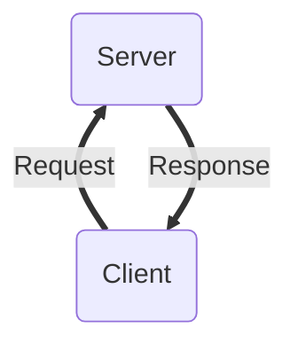

Actually what happens when you put [a link in here](https://fonts.google.com/specimen/Roboto+Slab)?

I write a lot of stuff with code blocks, and it would be nice to see what they look like.

## JavaScript

```js
function doSomething() {
  // define functions up here
}

window.addEventListener("load", function() {
  var loopCount = 20;
  for (var i = 0; i < loopCount; i++) {
    doSomething();
  }
});
```

## Python

```python
# Python
def sum(*args):
    total = 0
    for number in args:
        total += number
    return total

sum(3, 5, 9)
# => 17
```

And I can put text right after a code block, and it doesn't look bad either.

## Inline code

Okay, cool. But how about an inline code block? `npm install -g awesome` Yeah that looks really cool, but how does affect text that appears on the next line? Well it's broken over two lines now, but I think that using variables like `className` in a sentence will be fine.

## Graphs

Here's something pretty cool; graphs built with a Gatsby plugin for [Mermaid](https://mermaidjs.github.io/):



